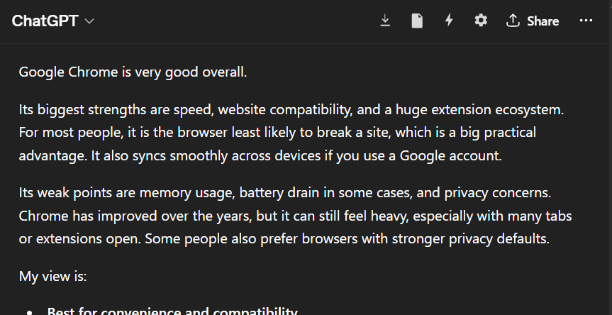
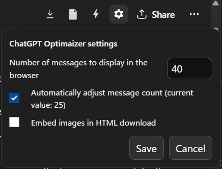
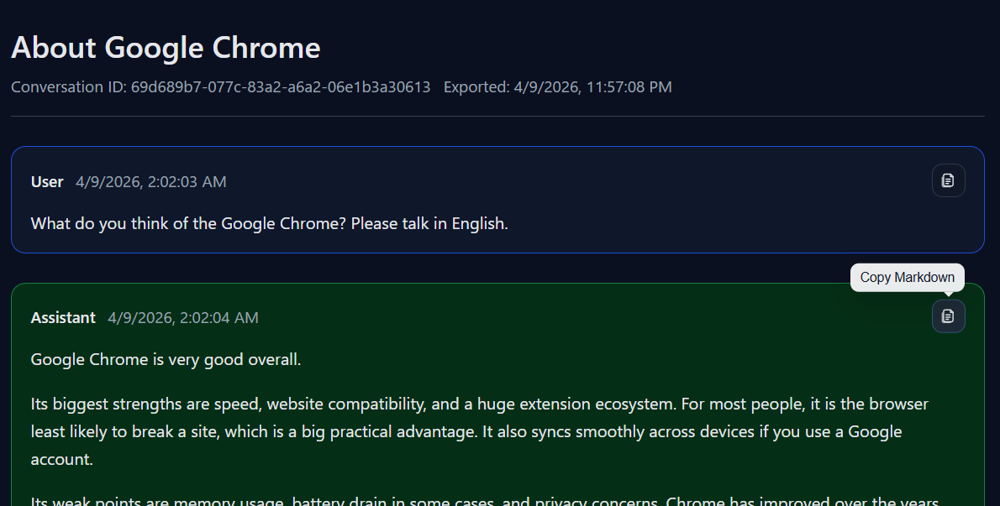
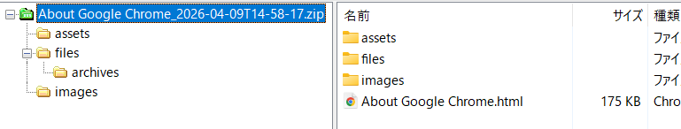

# Conversation Optimizer for ChatGPT

**Keep long ChatGPT conversations usable — and worth keeping.**

> Chat is meant to flow.  
> Useful in the moment, and not always meant to remain on the screen forever.  
>  
> But some conversations carry things worth keeping.  
> Decisions, context, experiments, and ideas that may matter again later.  
>  
> CGO lives somewhere in between:  
> letting conversation stay light,  
> while giving important words a way to remain.

Conversation Optimizer for ChatGPT is a Chrome extension designed to keep long conversations usable by reducing live UI weight and focusing on practical export.

---

## 🖼 Screenshots

### Conversation header tools

### Settings panel

### Lightweight HTML viewer

### ZIP / export workflow

---

## ✨ Features

### ⚡ Performance optimization for long conversations
- Reduces browser rendering load by keeping the active on-screen conversation smaller
- Helps long conversations remain responsive for much longer
- Designed for code-heavy, media-rich, and context-heavy chats

### 🎛️ Automatic and manual message control
- Automatically adjusts how many messages stay visible based on conversation size
- Allows manual control over the number of messages kept in the browser DOM

### 📦 Practical export tools
- Open a **Lightweight HTML** viewer for fast local browsing
- Download a standalone **HTML** archive of the conversation
- Download a **ZIP** archive that can also preserve attached files

### 📋 Copy support for everyday use
- Copy conversation content as Markdown
- Copy code blocks with one click

---

## 🛠 Installation

### From source
1. Download or clone this repository.
2. Open `chrome://extensions/` in Chrome.
3. Enable **Developer mode**.
4. Click **Load unpacked**.
5. Select this project folder.

### After installation
1. Open ChatGPT in Chrome.
2. Start or open a conversation.
3. The extension UI will appear in the conversation header when supported pages are detected.

---

## 🚀 Usage

### Basic usage
Once installed, the extension works directly on the ChatGPT web interface.

It helps keep long conversations lighter by reducing how much past content remains actively rendered in the browser at one time.

### Message visibility control
You can use the settings panel to:
- choose how many messages remain visible
- enable or disable automatic adjustment
- configure HTML export behavior

### Copy tools
Within exported views and supported UI areas, you can:
- copy message content as Markdown
- copy code blocks directly

### Recommended workflow
For very long conversations:

1. Continue working normally while the extension keeps the visible conversation lighter.
2. When you want to revisit older content, open the **Lightweight HTML** viewer.
3. When you want to keep a local archive, use **HTML Download**.
4. When you also want to preserve attachments, use **ZIP Download**.

---

## 📁 Export formats

### 💨 Lightweight HTML
Best for quickly reopening and browsing older conversation content.

- Fast and lightweight
- Good for local review
- Useful when you want smooth scrolling and quick access to past messages

### 🌐 HTML Download
Best for saving a standalone copy of the conversation.

- Easy to keep as a local archive
- Convenient for reading later in a browser
- Suitable when you mainly want the conversation itself

### 🗜️ ZIP Download
Best for fuller preservation.

- Saves the conversation in an exportable package
- Can include attached files
- Useful when you want to keep both the conversation and related assets together

---

## 🔒 Privacy

This extension is designed to work locally in your browser while interacting with the ChatGPT web app.

Its purpose is to optimize conversation display and export conversation data for the user’s own use.

- No separate external service is required for the core workflow
- The extension is intended to help you manage and preserve your own conversation content

---

## ⚠️ Limitations

- This extension depends on the structure and behavior of the ChatGPT web interface, which may change over time
- Older conversation content may not remain fully visible on screen at all times, by design
- Export results may vary depending on the type of content in the conversation
- Some images or attachments may not always be recoverable in every export mode
- Browser performance improvements can vary depending on conversation size, content type, and Chrome environment

---

## 🎯 Version 2 focus

Version 2 is designed around two goals:

1. keeping very long ChatGPT conversations practical  
2. making older conversation content easier to preserve and revisit

It is not only a performance tool, but also a workflow tool for people who rely on long ChatGPT sessions.

