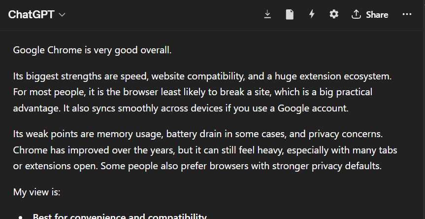
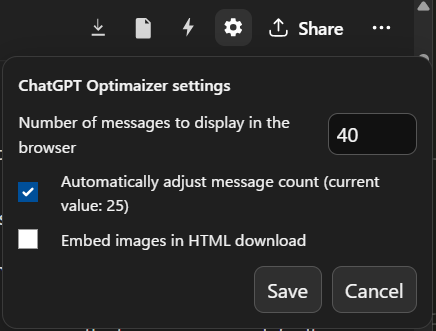
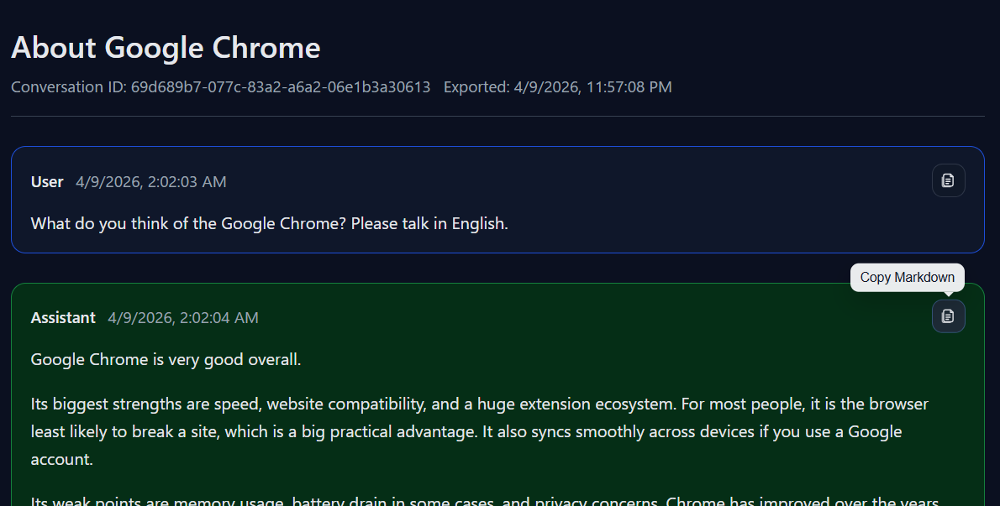
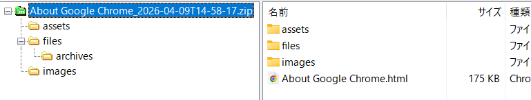
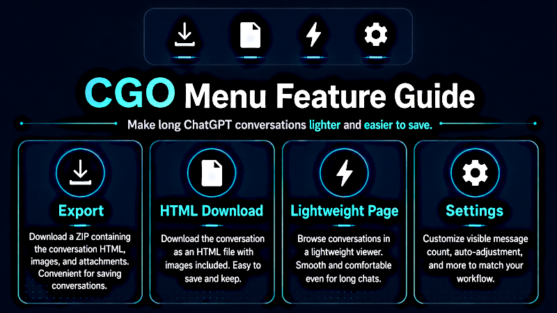

# Conversation Optimizer for ChatGPT 

**Export, preserve, and revisit the ChatGPT conversations worth keeping.**

Conversation Optimizer for ChatGPT (CGO) is a Chrome extension focused on exporting conversations from ChatGPT Web. It collects history that ChatGPT loads page by page and turns it into a lightweight viewer, a standalone HTML file, or a ZIP archive with downloadable assets where available.

CGO works in the signed-in ChatGPT Web session. It does not require an OpenAI API key or send conversation data to a CGO-operated server.

---

## What CGO does today

### Export long conversations

- Detects ChatGPT's paginated conversation format
- Accumulates older conversation pages while the browser is idle
- Fetches any remaining pages when an export starts
- Shows the number of collected messages while export-time history loading is in progress
- Reconstructs the available conversation in chronological order for export

### Choose the right export format

| Format | Best for | What it provides |
| --- | --- | --- |
| **Lightweight viewer** | Quickly reopening and reading a conversation | A dedicated local viewer with fast navigation and reading tools |
| **HTML** | Keeping a simple, portable archive | A standalone browser-readable conversation file, with optional embedded images |
| **ZIP** | Preserving the conversation and related files together | HTML plus downloadable images and attachments where ChatGPT makes them available |

### Read and reuse exported content

- Navigate between user messages from the conversation navigator
- Copy individual messages as Markdown
- Copy, collapse, and expand code blocks
- Review thoughts, generated images, and attachments when that data is available
- Open the original conversation in ChatGPT Web from the exported view

---

## Why CGO changed

CGO was originally created to address a problem with very large ChatGPT conversations. As an entire conversation remained loaded and rendered in the browser, the page could become increasingly heavy and eventually difficult to continue using. Early CGO versions reduced older off-screen content in the DOM so that long-running conversations could remain practical.

Export features were added gradually during that development: first as a way to revisit content removed from the live page, and later as useful tools in their own right.

ChatGPT Web now loads large conversation histories in pages. This change addresses much of the original browser-load problem, so CGO no longer removes rendered messages when the current paginated format is detected. Its main role is now to collect the available history and create useful, readable local exports.

The earlier DOM-retention behavior remains only as compatibility support for legacy full-conversation responses. Its settings are shown only when that older mode is detected.

---

## How it works

1. Open a conversation in ChatGPT Web.
2. CGO detects the conversation response and adds export tools to the conversation header.
3. For paginated conversations, CGO gradually collects older pages during idle time.
4. Choose the lightweight viewer, HTML, or ZIP export.
5. If history is still missing, CGO completes it first and displays the collected message count.
6. The selected output is generated locally in the browser.

CGO uses the interfaces available to the ChatGPT web app rather than the public OpenAI developer API. Because those web interfaces can change, CGO may occasionally require compatibility updates.

---

## Screenshots

### Conversation header tools

### Settings panel

Settings adapt to the history format detected for the current conversation.

### Lightweight viewer

### ZIP export

### Toolbar guide

---

## Installation

### Chrome Web Store

Install [Conversation Optimizer for ChatGPT from the Chrome Web Store](https://chromewebstore.google.com/detail/conversation-optimizer-fo/chmaignkjgccgmacmlfgnmbfbnnfmnpl).

### From source

1. Download or clone this repository.
2. Open `chrome://extensions/` in Chrome.
3. Enable **Developer mode**.
4. Select **Load unpacked**.
5. Choose this project folder.

The `main` branch contains the latest development version. Stable builds are published through GitHub Releases and the Chrome Web Store. See [Release preparation](docs/RELEASE.md) for packaging notes.

---

## Compatibility

CGO is designed for Google Chrome and is also confirmed to work on Microsoft Edge.

Other Chromium-based browsers may work, but behavior can vary with the browser and with changes to ChatGPT Web.

---

## Privacy

CGO runs locally in the browser and is intended for exporting your own conversation data.

- No CGO account or external CGO service is required
- No OpenAI developer API key is required
- Export data is prepared locally and saved or opened only when you request it
- Requests needed to collect conversation history and files use the active ChatGPT Web session

See [PRIVACY.md](PRIVACY.md) for the project privacy policy.

---

## Limitations

- CGO depends on ChatGPT Web's internal response formats and endpoints, which may change without notice
- Export can include only the conversation data and files available to the current ChatGPT session
- Some images, generated files, or attachments may be unavailable because of expired links, access restrictions, unsupported formats, or ChatGPT-side issues
- The paginated format exposes an ordered message history rather than the complete legacy branch graph, so alternate branches or versions may not always be reconstructed exactly as before
- Legacy DOM optimization is compatibility behavior and is not used for conversations handled by ChatGPT's current paginated format

---

## License

Conversation Optimizer for ChatGPT is available under the [MIT License](LICENSE).
